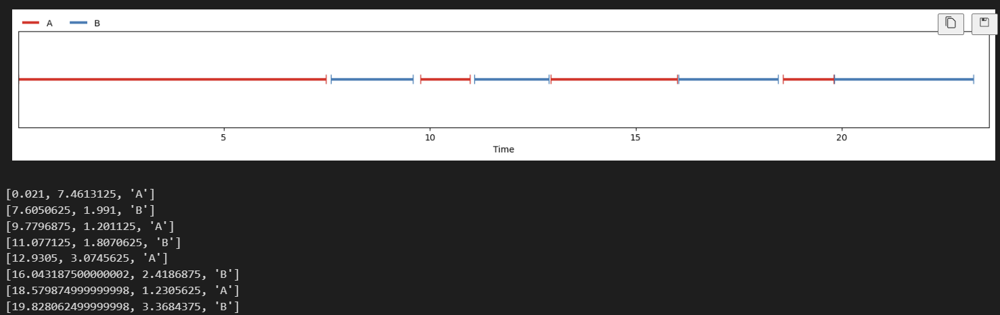

# Nano Diarization

[Pix2Seq](https://ai.googleblog.com/2022/04/pix2seq-new-language-interface-for.html) for Speaker Diarization.

[Video Explainer](https://youtube.com/watch?v=_Sq9AALDJFE)

# Instructions

```
pip install git+https://github.com/mogwai/nanodrz.git#egg=nanodrz
```

### Pre-processing

You'll need to do this before you can do inference in 3_inference.ipynb

```py
python scripts/preprocess.py
```

### Train

```sh
train configs/medium_mel.yaml
```

### Inference

These notebooks contain inference code. 

Download the [checkpoint](https://drive.google.com/file/d/1Cg_GPHxpcWMqGpsDlLMXlr5ui0mPYacn)

```
notebooks/3_inference.ipynb
notebooks/4_real_inference.ipynb
```

# Experiments

https://wandb.ai/harrycblum/nano-diarization?workspace=user-harrycblum

# Experiment Notes

https://fluxions.notion.site/nanodrz-Experiment-Log-acea3d5f436949b68e1f5a520c8cfdbc

# Overview

Diarization models in the wild currently combine a variety of models and are quite complex. This approach attempts to use synthetic data to experiment with overlapping speech difficulty.

### Architecture

At the highest level, the idea here is that if we as humans were to listen to random people talking, we may not know who they are but would be able to distinguish between the different speakers. This approach is trying to copy that ability. At the moment popular diarization pipelines are a collation of lots of different models. This approach attempts to try and to combine a lot of these into one. 

The basic idea is that we're taking a very compressed version of the the audio and predicting of 3 tokens for each section of speech. The first two tokens are the start and end quantized time tokens, the third being the speaker that spoke (A, B, C, ...).

Let's say we have 512 possible tokens, the first 2 are for end of sequence and padding. The last set of tokens are reserved the number of speakers that we can predict. To keep this simple, we're generated synthetic samples with 2 speakers < 30 seconds. This means that the tokens in between index 2 and 509 are for time embeddings. We quantize the continuous timestamps 0.2, 2.5 etc into fixed integers. (Look at the [Coordinate Quantization Notebook](https://github.com/mogwai/nanodrz/blob/master/notebook/Coordinate%20Quantization.ipynb))

So our sequence for our decoder only transformer is:

```
audio token, audio token, ... , start_diairise_cmd_token, start, end, label, start, end, label, ..., eos
```




### What about mapping A and B to real speakers.

Great question, we'll still need a second phase to do this so that we know who A and B are. But these speaker ID models are quite good now so giving it a few diarized sections to indentify who A is will hopefully work.

### Why synthetic data?

Transformers need a lot of data and this way we can make datasets on the fly without our models being able to overfit. It also make researching how approaches perform against harder problems (overlapping speech) which I don't think there is enough good real data in the wild to train a transformer on. 

### How to deal with longer audio

We'll be limited to doing chunks of audio, however we can prompt the model with some audio from the previous chunk:

Say we complete inference on our first chunk and identified two speakers, A and B. In the second chunk, we'll take 5 seconds of the audio for each speaker and prompt the model with is so that it knows who they are. This prevents the model swapping the labels for speakers between chunks.

2 chunk inference example

```
5 seconds of A, 200ms of silence, 5 seconds of B, 200ms silence, {audio we want to diarize}, start_diairise_cmd_token, 0, 5, A 5.2, 10.2, B, ..., eos
```

Yes we loose some capacity but this prevents us having to ID each chunks speaker labels at the end. 


# Core Questions

- Can we get transformers doing diarisation
- Can we create synthetic combinations of tts datasets to experiment with diarisation difficulty.
    - Will this help generalise to different domains.
- What happens as we increase the difficult of the data with interrupts, noise, number of speakers, loudness of speakers.

# License

I've chosen a strong copy left license for now because I want to get people giving back to this project.

# Reference

https://arxiv.org/pdf/2310.13025.pdf

# Credits

[James Parsloe](https://github.com/jamesparsloe) for project structure and lots of the utils found here.

[Herve Bredin](https://github.com/hbredin) for his amazing research on pyannote.audio

[Andrej Karpathy - NanoGPT](https://github.com/karpathy/nanoGPT/) For lots of great explanation on transformers and insparation for this codebase's style.

# Citation

```
@software{nanodrz_2024,
  author = {Coultas Blum, Harry},
  month = {01},
  title = {{nanodrz}},
  url = {https://github.com/mogwai/nanodrz},
  version = {1.0.0},
  year = {2024}
}
```